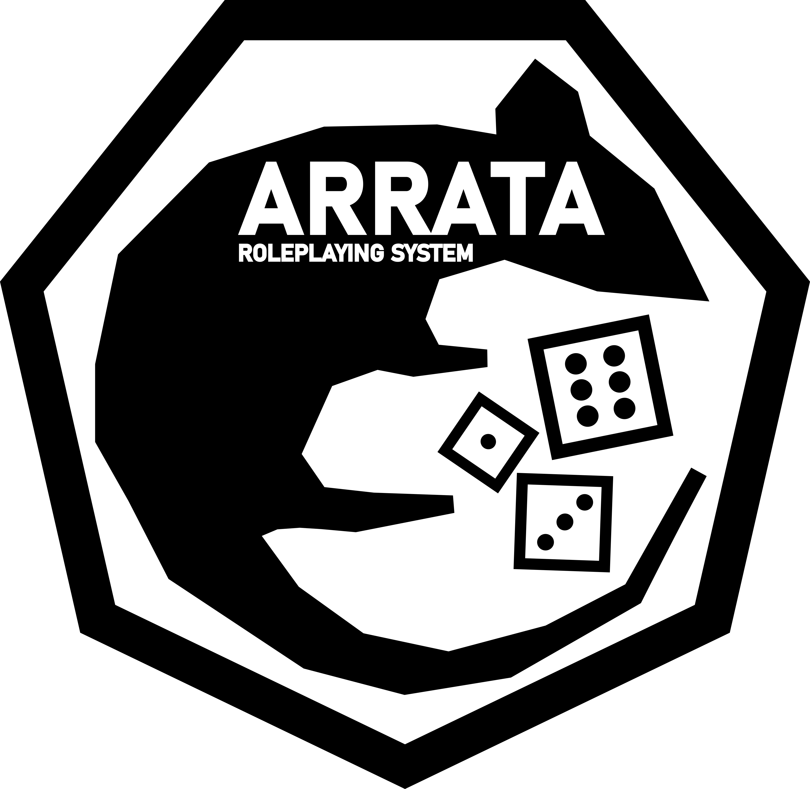

# ARRATA Roleplaying System

## Welcome

Arrata is a Tabletop Roleplaying system with an emphasis on characters and their development.

It draws influence from games such as The Elder Scrolls, Dungeons and Dragons, Burning Wheel, and much more.

The hope is to take a lot of the nuanced character interaction and development from games such as Burning Wheel, mesh them with systems similar to those in games such as D&D and TES, and provide an experience that's both mechanically rewarding and emotionally impactful.

## Getting Started

You can find the latest version of Arrata under the [latest release](https://github.com/kalebvonburris/Arrata-TTRPG/releases/latest).
